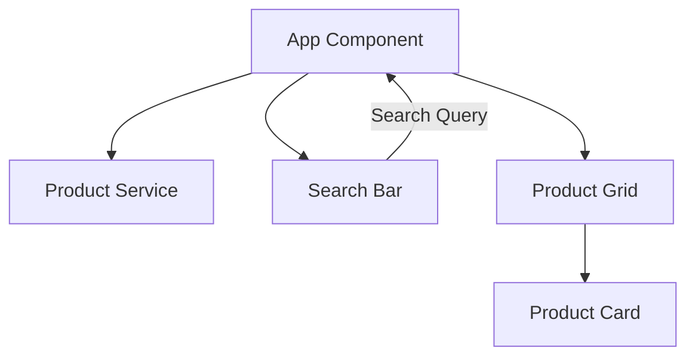

# Online Marketplace Platform

A modern, responsive online marketplace built with React, TypeScript, and Tailwind CSS. This application demonstrates best practices in frontend architecture, component design, and state management.


## 🌟 Features
a
- **Product Catalog**: Browse through a curated list of products with detailed information
- **Real-time Search**: Instantly search products by title and description
- **Responsive Design**: Fully responsive layout that works seamlessly across all devices
- **Modern UI/UX**: Clean and intuitive interface with smooth animations
- **Component Architecture**: Modular and reusable component structure
- **Type Safety**: Full TypeScript implementation for better development experience

## 🏗️ Project Structure

```
src/
├── components/          # Reusable UI components
│   ├── ProductCard.tsx  # Product display card component
│   └── SearchBar.tsx    # Search functionality component
├── hooks/              # Custom React hooks
│   └── useProducts.ts  # Products data fetching hook
├── services/           # API and external service integrations
│   └── productService.ts # Product data service
├── types/              # TypeScript type definitions
│   └── index.ts        # Shared type interfaces
└── App.tsx             # Main application component
```

## 🔧 Technical Stack

- **Frontend Framework**: React 18.3
- **Type System**: TypeScript
- **Styling**: Tailwind CSS
- **Icons**: Lucide React
- **Build Tool**: Vite
- **Linting**: ESLint
- **Code Formatting**: Prettier
- **State Management**: React Hooks

## 🚀 Getting Started

1. **Clone the repository**
   ```bash
   git clone [repository-url]
   ```

2. **Install dependencies**
   ```bash
   npm install
   ```

3. **Start development server**
   ```bash
   npm run dev
   ```

4. **Build for production**
   ```bash
   npm run build
   ```

## 📦 Component Architecture

### ProductCard
- Displays individual product information
- Handles product image, title, description, and price
- Includes action buttons for wishlist and cart

### SearchBar
- Provides real-time search functionality
- Implements debounced search for performance
- Integrated with Lucide React icons

## 🎯 Best Practices Implemented

1. **Component Organization**
   - Small, focused components with single responsibilities
   - Clear separation of concerns
   - Reusable UI components

2. **Type Safety**
   - Comprehensive TypeScript interfaces
   - Strict type checking
   - Well-defined prop types

3. **State Management**
   - Custom hooks for data fetching
   - Centralized product service
   - Efficient state updates

4. **Performance Optimization**
   - Lazy loading of images
   - Debounced search
   - Optimized re-renders

5. **Code Quality**
   - ESLint configuration for code quality
   - Consistent code formatting
   - Clear file and folder structure

## 🔄 Data Flow



## 🛠️ Development Guidelines

1. **Creating New Components**
   - Place in `src/components`
   - Use TypeScript interfaces for props
   - Include JSDoc comments for documentation

2. **Adding Features**
   - Create new service in `src/services`
   - Add types in `src/types`
   - Update README documentation

3. **Styling Guidelines**
   - Use Tailwind CSS utility classes
   - Follow mobile-first approach
   - Maintain consistent spacing

## 📱 Responsive Design

- Mobile-first approach
- Breakpoints:
  - sm: 640px
  - md: 768px
  - lg: 1024px
  - xl: 1280px

## 🔒 Security Considerations

- Input sanitization
- Secure API calls
- Protected routes
- XSS prevention

## 🔜 Future Enhancements

1. **Features**
   - User authentication
   - Shopping cart functionality
   - Order management
   - User profiles

2. **Technical**
   - Unit testing implementation
   - E2E testing
   - Performance monitoring
   - CI/CD pipeline

## 📄 License

MIT License - feel free to use this project for your own purposes.

## 🤝 Contributing

1. Fork the repository
2. Create your feature branch
3. Commit your changes
4. Push to the branch
5. Create a Pull Request

## 📞 Support

For support, please open an issue in the GitHub repository.
